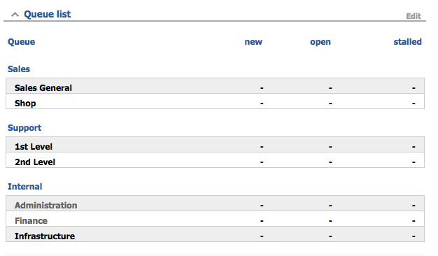

# Queue Categories Extension for Request Tracker

#### Table of Contents

1. [About](#about)
2. [License](#license)
3. [Support](#support)
4. [Requirements](#requirements)
5. [Installation](#installation)
6. [Configuration](#configuration)

## About

Allows you to categorize queues by a specific custom field.

In addition to the default functionality of custom fields, this extension utilizes the values of this custom field to
group queues in the following areas:

- Quick Ticket Creation Dropdown

  The one in the top right corner.  
  

- QueueList Dashboard Element

  The one that comes by default with RT.  
  

## License

This project is licensed under the terms of the GNU General Public License Version 2.

This software is Copyright (c) 2018 by NETWAYS GmbH [support@netways.de](mailto:support@netways.de).

## Support

For bugs and feature requests please head over to our [issue tracker](https://github.com/NETWAYS/rt-extension-queuecategories/issues).
You may also send us an email to [support@netways.de](mailto:support@netways.de) for general questions or to get technical support.

## Requirements

- RT 4.4.2

## Installation

Extract this extension to a temporary location.

Git clone:

    cd /usr/local/src
    git clone https://github.com/NETWAYS/rt-extension-queuecategories

Tarball download (latest [release](https://github.com/NETWAYS/rt-extension-queuecategories/releases/latest)):

    cd /usr/local/src
    wget https://github.com/NETWAYS/rt-extension-queuecategories/archive/master.zip
    unzip master.zip

Navigate into the source directory and install the extension.

    perl Makefile.PL
    make
    make install

Edit your `/opt/rt4/etc/RT_SiteConfig.pm`

Add this line:

    Plugin('RT::Extension::UpdateHistory');

Clear your mason cache:

    rm -rf /opt/rt4/var/mason_data/obj

Restart your webserver.

## Configuration

In order to enable this extension's functionality it is required to create a custom field first. This custom field
needs to be of the type "Select one value" and have the name "QueueCategory". (Although the name is configurable,
see below)

Once the custom field has been created, define the categories you want to use as values for the field. Remember to
apply the field to those queues you want to categorize and to manage authorization before continuing.

Now edit each queue you want to categorize and choose a value for the custom field. That's it.

### Order of Categories

It's possible to adjust the order of categories by defining a sort order for each value of the custom field.
If no custom sort order is provided, categories are sorted alphabetically by default.

### Alternative Custom Field Name

To use an alternative name for the custom field, define `$QueueCategories_CFName` and provide it as a string.

#### Example

```perl
Plugin('RT::Extension::QueueCategories');
Set($QueueCategories_CFName, 'Queue Group');
```
